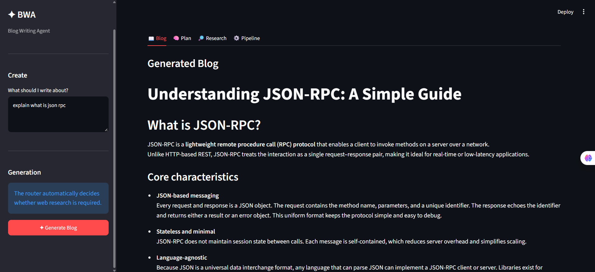
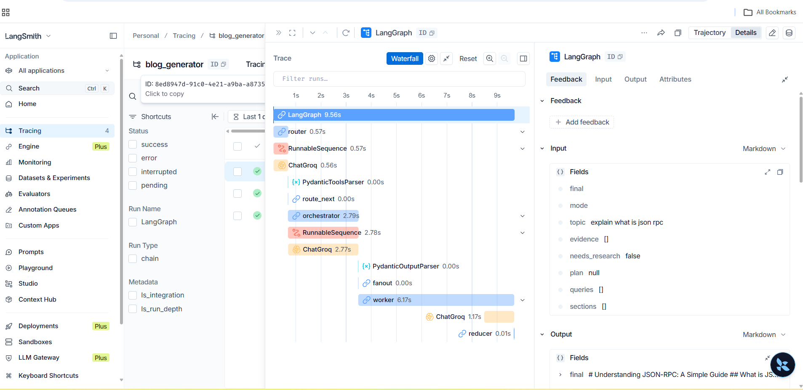

````markdown
# Agentic Content Orchestrator

A research-aware technical blog generation system built with **LangGraph, Groq, Tavily, Pydantic, Streamlit, and LangSmith**.

The system dynamically decides whether web research is required, creates a structured writing plan, generates sections through parallel LangGraph workers, and assembles the final Markdown article.

## Architecture

```text
User Topic
    │
    ▼
┌─────────────┐
│    Router   │
└──────┬──────┘
       │
       ├── Closed Book ───────────────┐
       │                              │
       └── Research Required          │
               │                      │
               ▼                      │
          Tavily Search               │
               │                      │
               ▼                      │
            Evidence ─────────────────┤
                                      ▼
                              ┌──────────────┐
                              │ Orchestrator │
                              └──────┬───────┘
                                     │
                              Fan-out Workers
                                     │
                    ┌────────────────┼────────────────┐
                    ▼                ▼                ▼
                 Worker 1         Worker 2         Worker 3 ...
                    │                │                │
                    └────────────────┼────────────────┘
                                     ▼
                                ┌─────────┐
                                │ Reducer │
                                └────┬────┘
                                     ▼
                              Final Markdown
````

## Features

* **Adaptive research routing** — determines whether a topic requires web research.
* **Structured planning** — generates a typed five-section writing plan using Pydantic.
* **Parallel generation** — uses LangGraph fan-out workers to generate sections independently.
* **Evidence grounding** — passes retrieved research to workers for factual grounding and citations.
* **Deterministic assembly** — restores section order before producing the final article.
* **Structured LLM outputs** — uses Pydantic schemas for predictable model responses.
* **Observability** — LangSmith provides traces for workflow and LLM execution.
* **Streamlit UI** — generates and downloads the final blog as Markdown.

## Workflow

1. **Router** classifies the topic as `closed_book`, `hybrid`, or `open_book`.
2. **Research** optionally retrieves and normalizes web evidence using Tavily.
3. **Orchestrator** creates a structured five-section writing plan.
4. **Workers** generate individual sections through LangGraph fan-out.
5. **Reducer** restores section order and produces the final Markdown document.

## Tech Stack

| Component              | Technology           |
| ---------------------- | -------------------- |
| Workflow orchestration | LangGraph            |
| LLM                    | Groq                 |
| Model                  | `openai/gpt-oss-20b` |
| Web research           | Tavily               |
| Structured schemas     | Pydantic             |
| Frontend               | Streamlit            |
| Observability          | LangSmith            |
| Language               | Python               |

## Screenshots

### Streamlit Interface



### LangSmith Workflow Trace



## Project Structure

```text
agentic-content-orchestrator/
├── bwa_backend.py
├── frontend.py
├── screenshots/
│   ├── frontend.png
│   └── langsmith.png
├── .gitignore
├── requirements.txt
└── README.md
```

## Setup

### 1. Clone the repository

```bash
git clone https://github.com/YOUR_USERNAME/agentic-content-orchestrator.git
cd agentic-content-orchestrator
```

### 2. Create and activate a virtual environment

Windows:

```cmd
python -m venv myenv
myenv\Scripts\activate
```

### 3. Install dependencies

```bash
pip install -r requirements.txt
```

### 4. Configure environment variables

Create a `.env` file:

```env
GROQ_API_KEY=your_groq_api_key
TAVILY_API_KEY=your_tavily_api_key

LANGCHAIN_TRACING_V2=true
LANGCHAIN_ENDPOINT=https://api.smith.langchain.com
LANGCHAIN_API_KEY=your_langsmith_api_key
LANGCHAIN_PROJECT=blog_generator
```

### 5. Run the application

```bash
streamlit run frontend.py
```

## Engineering Highlights

* Conditional routing with LangGraph
* Fan-out / parallel worker execution
* Typed state management with `TypedDict`
* Structured model outputs with Pydantic
* Research evidence normalization and deduplication
* Deterministic section ordering using reducers
* LangSmith tracing for workflow observability

## Future Improvements

* Section-level streaming in the UI
* Stronger source-quality and citation validation
* Persistent generation history
* Retry and failure handling for individual workers

```
```
